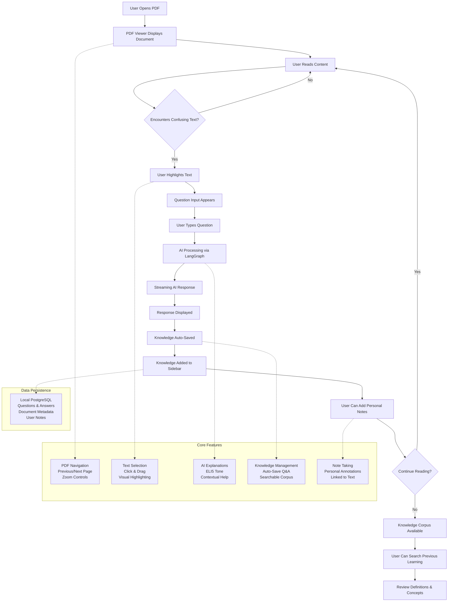
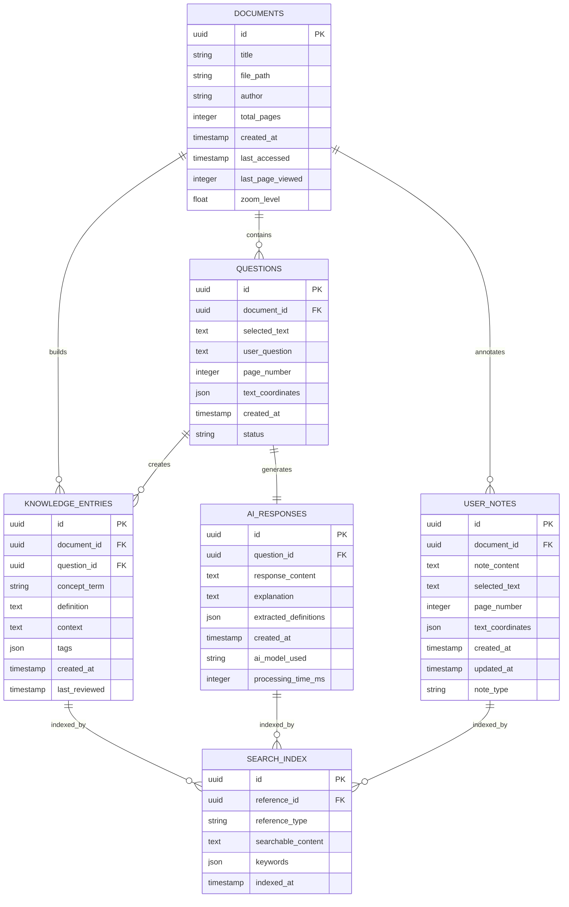

# GeniusReads Architecture Diagrams

## Overview

This document contains the core architecture diagrams for GeniusReads, including the user workflow and data model. These diagrams provide a visual representation of how the application functions and how data flows through the system.

## Core Functionality Flow

This diagram illustrates the complete user workflow and core features of GeniusReads:

### Workflow Explanation

1. **Reading Flow**: User opens PDF → reads content → encounters confusing text
2. **AI Interaction**: User highlights text → asks questions → receives streaming AI explanations  
3. **Knowledge Building**: AI responses are auto-saved → added to knowledge sidebar → user can add personal notes
4. **Knowledge Management**: Users can search their accumulated learning and review previous concepts

The diagram shows five core feature areas and the local PostgreSQL data persistence layer that supports the entire workflow.

## Data Model

This diagram shows the complete database schema with relationships between entities:

### Data Model Explanation

The database schema consists of six main entities:

#### Core Entities

- **DOCUMENTS**: Stores PDF metadata, file paths, and reading state (current page, zoom level)
- **QUESTIONS**: User questions with selected text and page coordinates for precise location tracking
- **AI_RESPONSES**: Complete AI explanations with extracted definitions and processing metadata
- **KNOWLEDGE_ENTRIES**: Processed concepts, terms, and definitions extracted from AI responses
- **USER_NOTES**: Personal annotations linked to specific text locations in documents

#### Supporting Entities

- **SEARCH_INDEX**: Enables full-text search across all content types (knowledge, responses, notes)

#### Key Relationships

- Documents contain multiple questions and user notes
- Each question generates exactly one AI response
- AI responses create multiple knowledge entries (extracted concepts)
- All content types are indexed for search functionality

### Data Flow

1. **Document Loading**: PDF metadata stored in DOCUMENTS table
2. **Question Creation**: User highlights text → QUESTIONS record with coordinates
3. **AI Processing**: Question generates AI_RESPONSES with explanations
4. **Knowledge Extraction**: AI responses create KNOWLEDGE_ENTRIES for concepts
5. **Search Indexing**: All content indexed for fast retrieval
6. **Note Taking**: User annotations stored as USER_NOTES linked to document locations

## Technical Implementation Notes

### Frontend Architecture
- **React components** handle UI state and user interactions
- **Custom hooks** manage complex state (text selection, AI streaming)
- **Tauri commands** bridge frontend to Rust backend

### Backend Architecture
- **Rust backend** with embedded Python via pyo3
- **PostgreSQL** for robust data storage and search
- **LangGraph** for AI workflow orchestration
- **Streaming responses** for real-time user feedback

### Key Design Decisions
- **Local-first**: All data remains on user's machine
- **Single PDF**: MVP limitation for simplified state management
- **Coordinate-based selection**: Precise text location tracking
- **Streaming AI**: Progressive response display for better UX

---

*Document created: Planning phase*  
*Last updated: Initial architecture documentation*  
*Next steps: Begin Task 1.1 - Tauri project initialization* 