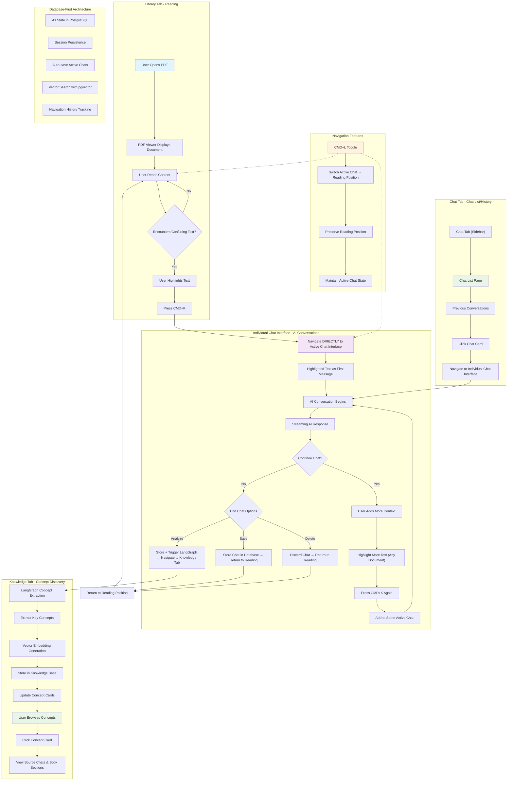
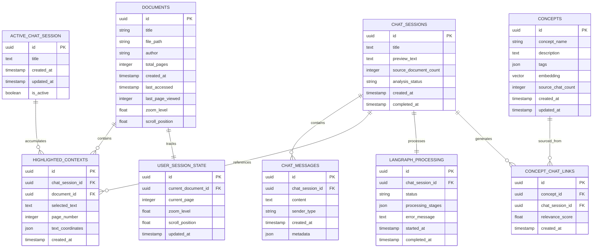
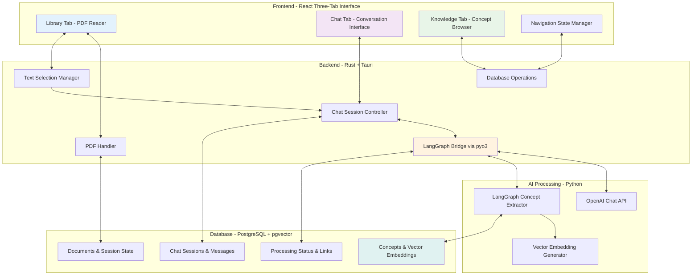

# GeniusReads Architecture Diagrams

## Overview

This document contains the core architecture diagrams for GeniusReads, including the three-tab user workflow and updated data model. These diagrams provide a visual representation of how the chat-based application functions and how data flows through the system.

## Core Functionality Flow

This diagram illustrates the complete three-tab user workflow and core features of GeniusReads:



### Workflow Explanation

**Three-Tab Structure**:
1. **Library Tab**: PDF reading with text selection and highlighting
2. **Chat Tab**: AI conversations with ChatGPT-style interface
3. **Knowledge Tab**: Concept browsing and detailed concept pages

**Core Interaction Flow**:
1. **Reading → Chatting**: User highlights text → CMD+K → navigates to Chat tab
2. **Active Chat**: One active chat accumulates highlighted contexts from any document
3. **Chat Completion**: User chooses Save/Save+Analyze/Delete options
4. **Knowledge Building**: LangGraph extracts concepts from analyzed chats
5. **Knowledge Discovery**: Users browse concepts and trace back to source conversations

**Navigation Features**:
- CMD+K: Highlight text → Chat tab
- CMD+L: Toggle between Library and Chat tabs
- Preserved reading positions and active chat state

## Data Model

This diagram shows the updated database schema optimized for chat-based conversations:



### Data Model Explanation

The database schema supports the three-tab chat-based architecture:

#### Core Entities

- **DOCUMENTS**: PDF metadata and reading state (page, zoom, scroll position)
- **USER_SESSION_STATE**: Current navigation state for seamless tab switching
- **ACTIVE_CHAT_SESSION**: Single active chat that accumulates highlighted contexts
- **CHAT_SESSIONS**: Completed chat conversations with metadata
- **CHAT_MESSAGES**: Individual messages in ChatGPT-style conversations

#### Context and Knowledge Entities

- **HIGHLIGHTED_CONTEXTS**: Text selections with precise coordinates and source documents
- **CONCEPTS**: Extracted concepts with vector embeddings for semantic search
- **CONCEPT_CHAT_LINKS**: Relationships between concepts and source conversations
- **LANGRAPH_PROCESSING**: Background processing status and progress tracking

#### Key Relationships

- One active chat session accumulates contexts from multiple documents
- Chat sessions contain multiple messages and highlighted contexts
- LangGraph processing extracts multiple concepts from chat sessions
- Concepts link back to source chats with relevance scores
- User session state maintains navigation context across tabs

### Data Flow Patterns

1. **Text Selection Flow**: Document → Highlighted Context → Active Chat
2. **Chat Flow**: Active Chat → Messages → Completed Chat Session
3. **Analysis Flow**: Chat Session → LangGraph Processing → Concepts
4. **Knowledge Flow**: Concepts → Chat Links → Source Documents
5. **Navigation Flow**: User Session State ↔ All Tabs

## LangGraph Concept Extraction Workflow

This diagram shows the automated concept extraction process:

```mermaid
flowchart TD
    subgraph "Input Processing"
        A[Chat Session Completed] --> B[User Chooses "Save + Analyze"]
        B --> C[Trigger LangGraph Workflow]
        C --> D[Parse Chat Messages]
        D --> E[Clean and Structure Content]
    end

    subgraph "Concept Extraction & Analysis"
        E --> F[Extract Key Concepts/Entities]
        F --> G[Generate Concept Descriptions]
        G --> H{Loop Through Each Concept}
    end

    subgraph "Knowledge Base Interaction"
        H --> I{Concept Exists in DB?}
        I -->|Yes| J[Calculate Vector Similarity]
        J --> K{Similarity > Threshold?}
        K -->|Yes| L[Merge with Existing Concept]
        K -->|No| M[Create New Related Concept]
        
        I -->|No| N[Generate Vector Embedding]
        N --> O[Create New Concept Entry]
        
        L --> P[Update Concept Description]
        M --> Q[Store as Separate Concept]
        O --> Q
        P --> R[Create Chat-Concept Link]
        Q --> R
    end

    subgraph "Output & Storage"
        R --> S[Update Concept Cards UI]
        S --> T[Mark Processing Complete]
        T --> U[Update Knowledge Tab]
    end

    subgraph "Error Handling"
        V[Processing Error] --> W[Log Error Message]
        W --> X[Show Retry Option]
        X --> Y[Mark Processing Failed]
    end
    
    style A fill:#e1f5fe
    style I fill:#fff3e0
    style S fill:#e8f5e8
    style V fill:#ffebee
```

### LangGraph Processing Stages

1. **Input Processing**: Parse completed chat sessions and prepare for analysis
2. **Concept Extraction**: Use LangGraph to identify key concepts and generate descriptions
3. **Similarity Analysis**: Compare new concepts with existing knowledge base using vector embeddings
4. **Knowledge Integration**: Merge similar concepts or create new entries as appropriate
5. **UI Updates**: Refresh Knowledge tab with new concepts and processing status

## Technical Implementation Architecture



## Architecture Design Principles

### Database-First Architecture
- **Single Source of Truth**: All state stored in PostgreSQL
- **Session Persistence**: Survives app restarts and crashes
- **No Caching Layer**: Simplified architecture with database performance
- **Vector Search**: pgvector extension for semantic concept matching

### Three-Tab Navigation
- **Seamless Switching**: CMD+K and CMD+L for quick navigation
- **State Preservation**: Reading positions and active chats maintained
- **Progressive Enhancement**: Each tab builds on the previous tab's data

### Chat-Centric Design
- **One Active Chat**: Accumulates contexts from multiple documents
- **User Control**: Explicit choice for knowledge base integration
- **Background Processing**: Non-blocking concept extraction

This architecture provides a solid foundation for the chat-based learning workflow while maintaining simplicity and performance through the database-first approach.

---

*Document created: Planning phase*  
*Last updated: Initial architecture documentation*  
*Next steps: Begin Task 1.1 - Tauri project initialization* 